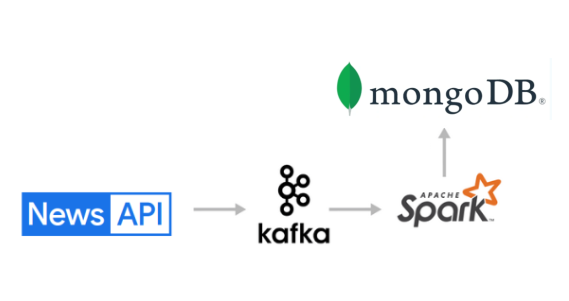

# newsAPI kafka spark mongodb ETL

> [!NOTE]
> Here, I have extracted data from a newsapi using keywords. 
> Then, streamed this data using Kafka to PySpark (using Spark-Kafka connectors). 
> Later, spark stream is stored MongoDB sink (using Spark-MongoDB connectors).  
> **Verisons used:** Pyspark v3.2.4, Kafka v2.8.1-scala 2.12, MongoDB v7.0.12

**Please checkout the code available in src folder.**

**_Steps:_**

1. Install MongoDB from its official site. (Installation steps are explained in detail in there.)
2. Start and enable mongo server at the boot.
3. Install Kafka for real-time streaming.
    1. Run zookeeper server.
    2. Run kafka broker.
4. Run a Kafka-producer program extracting news using News API.
5. Run a Kafka-consumer program using pyspark.
    1. Create a spark session using necessary jar files.
    2. Read streamed input from kafka.
    3. Convert json data by applying new schema.
    4. Write processed data to mongoDB collection.

> [!IMPORTANT]
> Compatibility of versions between Spark-Kafka and Spark-MongoDB connectors are a headache. 
> First, try to find out the compatible connectors for the required Spark version for a successful run.
